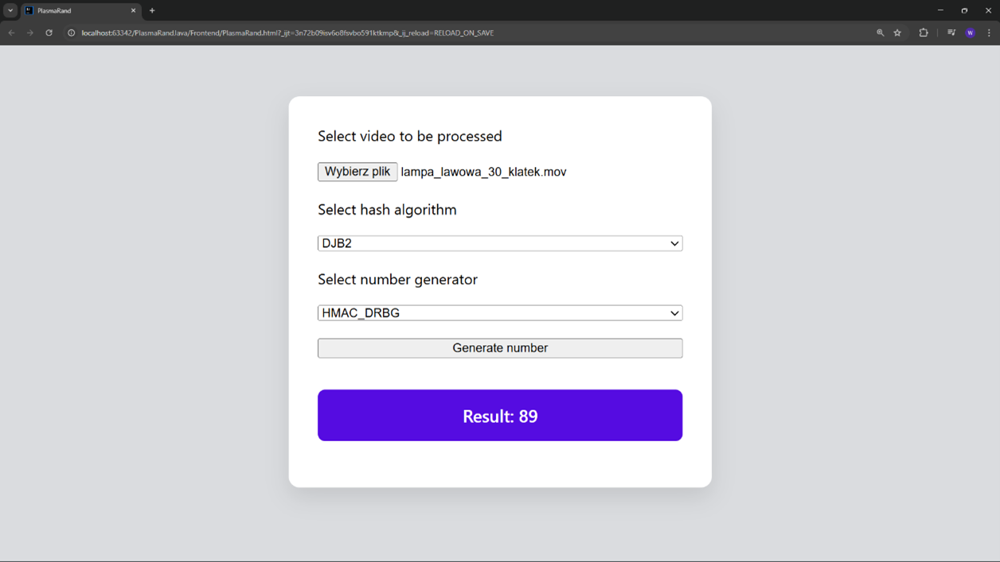
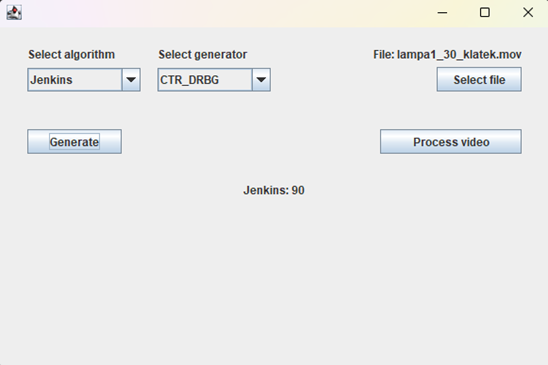

# PlasmaRand Prototype

## Overview
PlasmaRand is an innovative system designed to generate truly random numbers by leveraging the unpredictable nature of physical phenomena. This project serves as a prototype developed primarily to conduct comprehensive randomness tests and to demonstrate the potential interface and operational workflow of the application.
While system is conceptually designed to monitor plasma lamps via camera to capture electrical discharges, the current prototype is functional with any user-provided video file. The captured frames are converted and processed through hashing algorithms to serve as high-entropy seeds for random number generators. This approach ensures a significantly higher degree of randomness compared to standard pseudo-random algorithms.

---

## Core Features
* **Video-Based Entropy Source:** Converts visual data from provided video files into byte arrays that serve as input for hashing algorithms.
* **Hashing Algorithms:** Supports various hashing strategies, including SHA-256, SHA-512, and bitwise algorithms like DJB2 or Knuth, to produce uniform seeds.
* **CSPRNG Generation:** Uses hashed visual entropy as a seed for Cryptographically Secure Pseudo-Random Number Generators to generate number for user.
* **Dynamic Algorithm Selection:** Utilizes the *Strategy* pattern to allow the seamless exchange of hashing and CSPRNGs algorithms without modifying the core client code.
* **Hybrid Deployment:** Features both a native Java Swing desktop application and an web-based interface, both utilizing shared business logic.
* **Results Logging:** Saves all results to a *SQLite* database, including the hash used, the generated number, and precise date when generation occured.
* **NIST Randomness Test Export:** Exports generated bit sequences to ASCII files, which are required to perform NIST tests.

---

## Technology Stack

### **Frontend**
* **Language:** JavaScript
* **Web Technologies:** HTML, CSS

### **Backend**
* **Language:** Java
* **Database:** SQLite
  
### **Architecture & Tools**
* **Architecture:** MVC (Model-View-Controller)
* **Development Environment:** IntelliJ IDEA

---

## Architecture & Design
The project is designed with focus on modullarity and clear separation of concerns:
* **MVC Pattern:** Application follows the MVC pattern to separate domain logic from the user interface. This ensures that the core logic remains independent, with the Controller managing all communication between layers.
* **Strategy Pattern:** Pattern is used to handle all implemented hashing algorithms and random number generators. It allows to switch between different algorithms dynamically.
* **Repository Pattern:** Repository layer is implemented to abstract the data access process.
* **Dependency injections:** System utilizes the DI to achieve loose coupling between components. 
* **Interface-Based Design:** Key system components are defined using interfaces. This ensures that the main logic is not tied to any single implementation, making code much more flexible.

---

## Visuals
* **Web Interface:**
* 
* **Java Swing:**
* 
  
---

## Documentation

Detailed documentation is available in Polish and provides an overview of the development process and technical decisions. Documentation includes:
* **Project Scope:** Description of goals and core functionalities.
* **Architecture Analysis:** Breakdown of the *MVC* pattern implementation.
* **Implementation Details:** Technical details regarding backend logic and communication with frontend.
* **Unit Testing:** Summary of testing process.

[Full documentation (PDF)](Documentation/PlasmaRand_Documentation.pdf)
